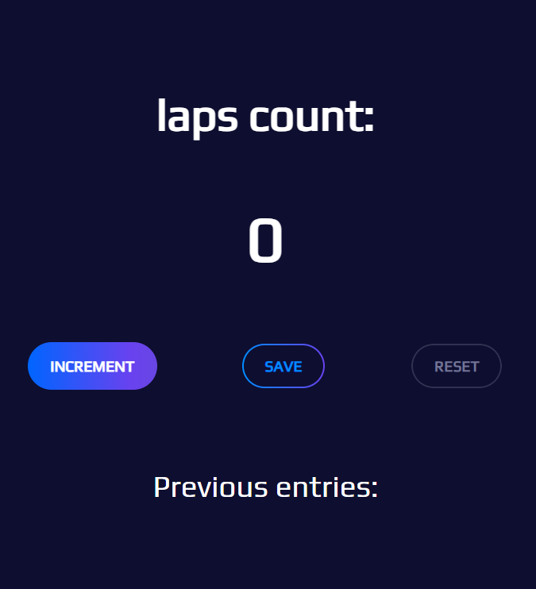
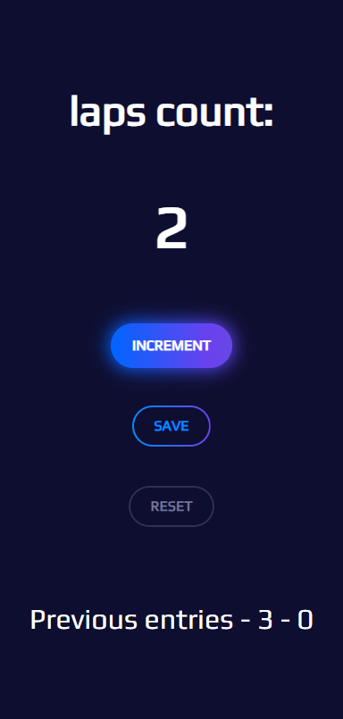

## Overview
This is a simple tally counter built with HTML, CSS and JavaScript.

The project folder includes:
* Project code
* Screenshots of the application

Features:
* Interactive buttons with color and transition effects

Screenshots
* Wide screen:

* Small screen
